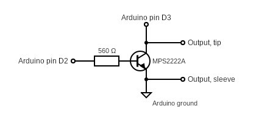

sony_slink
==========

This is an Arduino program to interface with Sony equipment using the
S-Link/Control A1 protocols.

I'm using this to control and read information from a Sony STR-DE635
receiver. You can use [this plugin](https://github.com/robho/hass_sony_slink)
to Home Assistant to include your Sony equipment in home automation projects.

You need to connect some components to your Arduino:

Use a 3.5 mm mono plug to connect the Arduino to the S-Link/Control A1 port of the Sony equipment and connect the Arduino to a USB port in your computer for power and serial communication.

Use the serial port to send commands to the Sony equipment. Commands are sent as lines of hexadecimal data. Here are some commands to try:

* c02e - power on amplifier
* c02f - power off amplifier
* c06a - query amplifier name

Take a look [here](http://boehmel.de/slink.htm) for more commands.

----

Reference documents:
* http://web.archive.org/web/20070720171202/http://www.reza.net/slink/text.txt
* http://web.archive.org/web/20070705130320/http://www.undeadscientist.com/slink/
* http://web.archive.org/web/20180831072659/http://boehmel.de/slink.htm
